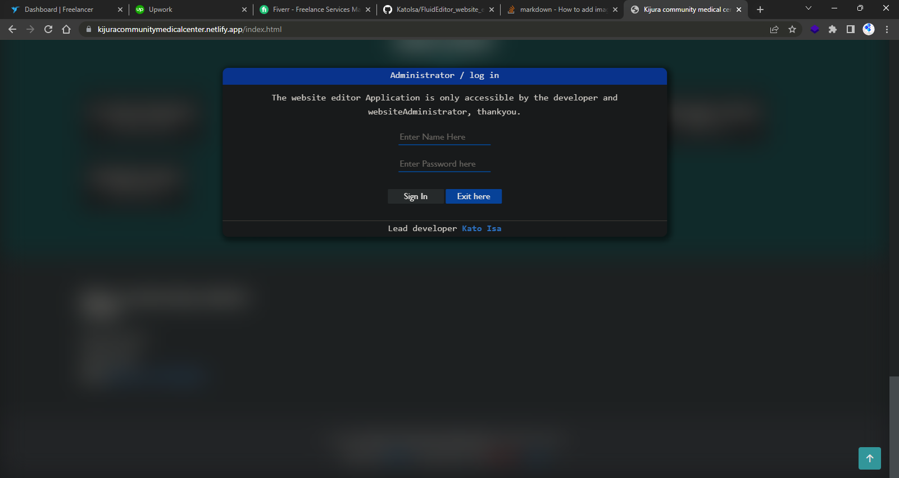
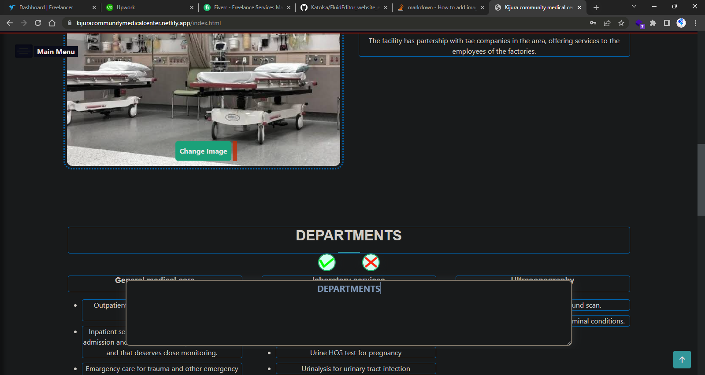
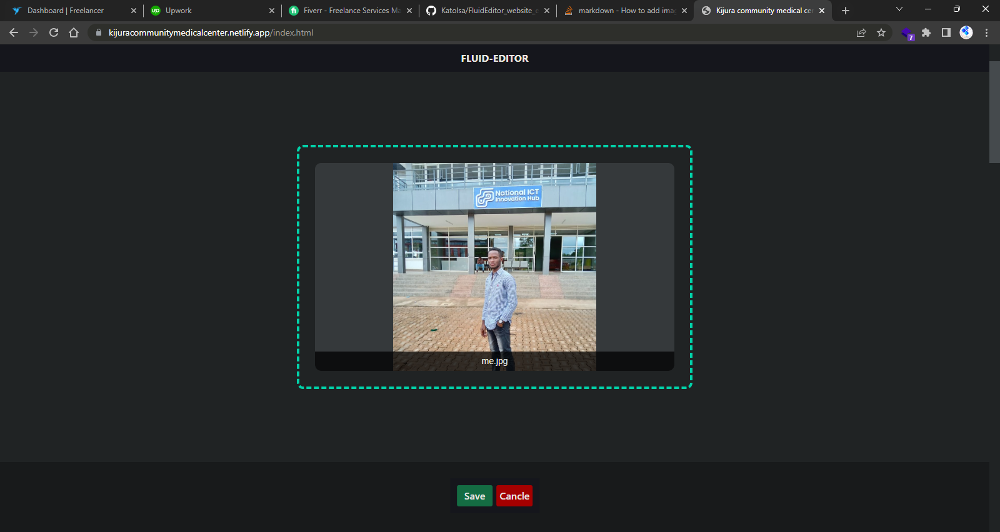

# fluidmanager_site_editor.
Javascript library that edits websites without the need to do any fancy logging into a cpanel or WordPress dashboard etc.

# `ALERT`
This project uses my library called simplify.js, it changes the syntax you 
might not understand it at first look through the library
## `Simplify.js ->` [Here](https://github.com/KatoIsa/Simplified_JS.git)

## ADMIN LOG-IN.
# ADMIN LOG-IN.

# CHANGE SITE TEXT WITH EASE.

# CHANGE SITE IMAGES WITH EASE.

